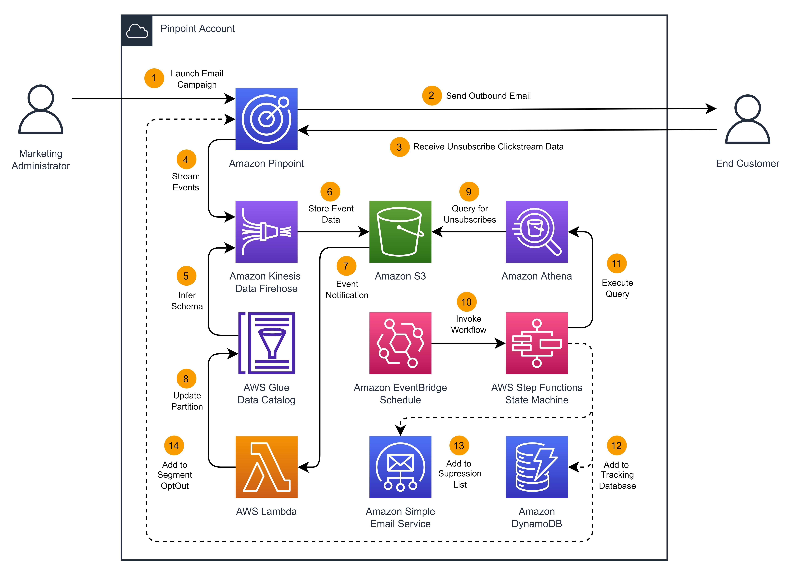
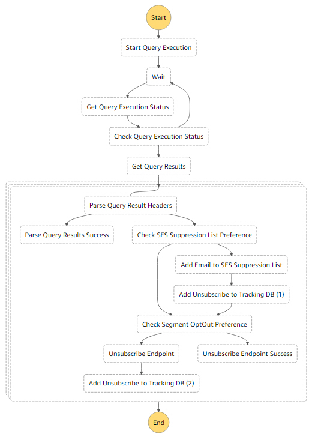

# How to Manage Email Unsubscribes in Amazon Pinpoint

## Introduction 
This repository provides a solution that helps you automate the management of Pinpoint unsubscribe events. It utilizes [AWS Step Functions](https://aws.amazon.com/step-functions/) to orchestrate the addition of endpoint email addresses to the [Amazon Simple Email Service](https://aws.amazon.com/ses/) suppression list, and/or update the endpoint's OptOut status within the [Amazon Pinpoint](https://aws.amazon.com/pinpoint/) segment definition, based on the customer's preference and unsubscribe event data.

This is the solution for the AWS blog post [How to Manage Email Unsubscribes in Amazon Pinpoint](https://aws.amazon.com), where you can find step-by-step instructions. This solution leverages portions of the [Digital User Engagement Events Database](https://aws.amazon.com/solutions/implementations/digital-user-engagement-events-database/). If you are looking for an event database solution covering email and SMS across Amazon Pinpoint and Amazon Simple Email Service, I recommend exploring the Digital User Engagement Events Database solution further.

## Solution overview


The solution overview above provides an overview of the components used in this solution, and for illustrative purposes I will step through them here.

1.	Marketing professionals create an email campaign within Amazon Pinpoint, and specify a segment, message template, and schedule.
2.	Pinpoint sends the email message to the end customer based upon the schedule configuration.
3.	The end customer receives the email and clicks on a specially-formatted unsubscribe link. This clickstream event data is sent back to Pinpoint.
4.	Pinpoint streams event data to Amazon Kinesis Data Firehose for reporting purposes and long-term storage.
5.	Kinesis Data Firehose reformats the JSON event data to Parquet to optimize query performance and minimize cost, and interprets in the incoming schema with a definition in AWS Glue.
6.	Kinesis Data Firehose then delivers this reformatted data to an Amazon S3 bucket.
7.	Event notifications are sent to AWS Lambda as new event data arrives within the S3 bucket.
8.	AWS Lambda processes these event notifications and dynamically adds partitions in AWS Glue.
9.	An Amazon Athena query is defined to extract unsubscribe events from the event data in S3.
10.	An Amazon EventBridge scheduler periodically invokes an AWS Step Functions state machine to process the unsubscribe events.
11.	The Step Functions state machine starts the Athena query execution to process unsubscribe events in S3. 
12.	Optionally, the Step Functions state machine extracts relevant details about the unsubscribe event and stores them in an Amazon DynamoDB table for tracking purposes.
13.	Optionally, the Step Functions state machine will add the end customers’ email address to the account level suppression list in Amazon Simple Email Service.
14.	Optionally, the Step Functions state machine will update the opt-out status of the endpoint within the segment definition in Pinpoint.

## Prerequisites
Before you proceed, ensure that within your environment you have:
*	An Amazon Pinpoint environment that has [production access](https://docs.aws.amazon.com/pinpoint/latest/userguide/channels-email-setup-production-access.html).
*	[Verified an email domain](https://docs.aws.amazon.com/pinpoint/latest/userguide/channels-email-manage-verify.html#channels-email-manage-verify-domain) to use for sending email campaigns.
*	[Permissions](https://docs.aws.amazon.com/AWSCloudFormation/latest/UserGuide/using-iam-template.html) to create the resources listed below using CloudFormation.

## Deployment process
Deployment of this solution is composed of two parts; the creation of an S3 bucket to store two AWS Lambda functions, and deployment of a CloudFormation stack to create the resources depicted in the solution overview above.

The first function, `custom-resource-lambda.zip`, is used as a resource helper function when deploying the CloudFormation template, and automates the creation of the Athena named queries.

The second function, `athena-partition-lambda.zip`, is used to dynamically create partitions in Glue.


### Create an S3 bucket
You’ll first need to create an S3 bucket to store the two Lambda functions.

1.	Navigate to the Amazon S3 console.
2.	Select **Create bucket**.
3.	Enter a unique name for **Bucket name**.
4.	Select the **AWS Region** to be the same as the one you will deploy the CloudFormation template to.
5.	Scroll to the bottom of the page and select **Create bucket**.
6.	Clone this GitHub repository to your local machine.
7.	Once the repository has been cloned locally, navigate to the `\amazon-pinpoint-manage-email-unsubscribes\source` folder.
8.	Upload the two .zip files for each Lambda function to the S3 bucket created above.

### Create a CloudFormation stack
The remainder deployment process of this solution is performed in a single AWS CloudFormation template to be deployed to your Amazon Pinpoint account. Prior to proceeding with the deployment, ensure that your environment meets the prerequisites listed above. Before launching the stack, make note the ARN of the email domain you previously verified in Pinpoint, as well as the bucket name created above, as both will be captured as input parameters. 

1.	Navigate to the AWS CloudFormation console select **Create stack > With new resources (standard)**.
2.	For Prerequisite – Prepare template, select **Template is ready** and choose **Upload a template file**.
3.	Select **Choose file**, and from the cloned repository, navigate to the `\amazon-pinpoint-manage-email-unsubscribes\deployment` folder, and upload the `PinpoinUnsubscribeManagement.yml` template file.
4.	Select **Next** to proceed to the Specify stack details screen.
5.	For **Stack name**, enter `PinpointUnsubscribeManagement`.
6.	For **S3 Source Bucket Name**, enter the bucket name created above.
7.	For **Pinpoint Project Name**, enter `DemoUnsubscribeProject`.
8.	For **Message Template Name**, enter `DemoMessageTemplate`.
9.	For **Pinpoint Verified Email Identity**, enter the full ARN of your validated email domain.
10.	For **Pinpoint Sender Address**, enter the address you would like to use as the email sender.
11.	For **Amazon Athena / AWS Glue Database Name**, enter `demo_event_db`.
12.	For **Add Endpoint to SES Suppression List**, choose `true`.
13.	For **Add Endpoint to Pinpoint Segment OptOut List**, choose `true`.
14.	Choose **Next**.

After you’ve entered all details, launch the stack and wait until the stack has reached CREATE_COMPLETE status before proceeding.

## Test the solution
With the solution fully deployed, you now need to import a segment, create and launch an email campaign, and generate a few unsubscribe events.

### Create a Pinpoint segment
Segment definitions determine where campaigns are sent, and include details such as the channel type, address, user attributes, and custom metrics. Segment definitions are associated with specific Pinpoint projects, so you will need to create a segment to test this solution.

1.	Navigate to your Pinpoint console and select the **DemoUnsubscribeProject**. 
2.	Within your project, select **Segments**. 
3.	Select the option to **Import a segment**. 
4.	Download a sample segment definition and substitute your test user details.
5.	Import this segment into Pinpoint. 

**Note:** Imported segment definitions in Pinpoint require certain attributes, and can be formatted as JSON or CSV files. At a minimum, you will need to specify an Address and ChannelType attribute, and I recommend specifying at least three addresses you can test with. Ensure you have access to these email accounts to initiate the unsubscribe events. Below is a sample segment definition you can repurpose with your user details. When importing, name this segment DemoSegment.

```CSV
ChannelType,Address,User.UserAttributes.FirstName
EMAIL,bob@mydomain.com,Bob
EMAIL,mary@mydomain.com,Mary
EMAIL,susan@mydomain.com,Susan
```

### Create a Pinpoint campaign
Campaigns are the mechanism Pinpoint uses to engage with customers over email, in-app messaging, SMS, push notifications, and custom channels. Campaigns are associated with specific Pinpoint projects, so you will need to create a segment to test this solution.

1.	Navigate to your Pinpoint console and select the **DemoUnsubscribeProject**.
2.	Within your project, select **Campaigns**.
3.	For **Campaign name**, enter `DemoCampaign_v1`.
4.	For **Campaign type**, select **Standard campaign**.
5.	For **Channel**, select **Email**.
6.	Select **Next**.
7.	Under **Segment details**, choose the segment you imported earlier, and validate that the segment estimate accurately represents the number of endpoints in your segment definition.
8.	Choose **Next**.
9.	Under **Email template**, choose the `DemoMessageTemplate` created for you during the CloudFormation stack deployment process. Select the default option to Use the version that’s currently active.
10.	Scroll down to **Email settings**, and verify that the sender address you entered during as a CloudFormation stack parameter is shown. Provide a friendly sender name of your choosing.
11.	Select **Next**.
12.	Under **Campaign setup**, select **Immediately** to specify when the campaign should be run. 
13.	Select **Next**.
14.	Review your settings and select **Launch campaign**.

### Generate unsubscribe events
After a minute or two, you will receive an email in the inbox of each endpoint you specified in your segment definition. Within this email, take note of the option provided to users to unsubscribe by clicking the configured link. Do this for one or two of the endpoints you specified. 

**Note:** The URL behind the unsubscribe link is independent of the unsubscribe event generated by Pinpoint when this linked is clicked. In the DemoMessageTemplate created for you, this link redirects the recipient to https://aws.amazon.com, however, in production environments it is common to direct the recipient to a confirmation page, or a solution such as the [Amazon Pinpoint Preference Center](https://aws.amazon.com/solutions/implementations/amazon-pinpoint-preference-center/).

## Review the results
The unsubscribe events will be streamed into the Kinesis Data Firehose created during the deployment process, and the Athena Partition Lambda function will automatically add partitions based on the arriving event data in S3. 

Separately, the EventBridge schedule will periodically invoke the Step Functions state machine to process the unsubscribe events, and includes the following payload based on your input during the CloudFormation stack creation process. This payload is then passed to the Step Functions state machine, and provides instruction on where the unsubscribe events should be recorded. 

```JSON
{ 
    "AddToSegmentOptOut": true,
    "AddToSesSuppressionList": true 
}
```

The logic of the Step Functions state machine used to process Pinpoint unsubscribe events is as follows. 



1.	An EventBridge schedule invokes the Step Functions state machine every five (5) minutes.
2.	The Step Functions state machine invokes an Athena query for the unsubscribe event data.
3.	The Step Functions state machine will wait for five (5) seconds and will check the query execution status.
4.	If the query has not completed, the Step Functions state machine will wait for another five (5) seconds and check the query status. This process will repeat until the query is complete.
5.	When the query has completed, the Step Functions state machine will obtain the query results.
6.	A map state is entered to process each result, and the Step Functions state machine will check for the first row of column headers and will discard.
7.	For each unsubscribe event, the Step Functions state machine will check the SES suppression list and Pinpoint segment opt-out preference, and will add the endpoint to each as specified by your input parameters. The Step Functions state machine will also record the unsubscribe event in DynamoDB.

## Customizing the solution
Readers are encouraged to customize this solution to meet their needs, and can do so after cloning the repository to their local machine. Notably, the EventBridge schedule created during the solution deployment process runs every five (5) minutes to speed up the time needed to demonstrate the solution. Readers should consider customizing the EventBridge schedule to run less frequently within a production environment.

In addition, the Athena query invoked by the Step Functions state machine will only retrieve unsubscribe events having a timestamp within the last fifteen (15) minutes. In your environment, I would recommend adjusting this to align with the frequency of the EventBridge schedule listed above.

## Solution cleanup
To remove the solution and avoid incurring additional charges for the AWS resources used in this solution, perform the following steps.

1.	Open the CloudFormation console in your Pinpoint account.
2.	Locate the `PinpointUnsubscribeManagement` stack, navigate to the Outputs tab, and note the name of the `PinpointEventsS3Bucket`. 
3.	Still within the `PinpointUnsubscribeManagement` stack, choose **Delete**.
    * **Note**: This will delete all resources deployed by this CloudFormation stack, with the exception of the S3 bucket used to store event data. You may choose to retain this bucket, or can empty and delete it.
4.	Navigate to the S3 console and locate the bucket created earlier to store the two Lambda functions. Empty this bucket and delete it.
5.	Navigate to the SES console and locate the suppression list. Remove any entries added to it.

## Summary
In this solution, we demonstrated how to process Amazon Pinpoint email unsubscribe event data with purpose-built AWS automation and analytics services. This solution will provide customers with a mechanism to maintain compliance with federal regulations by providing customers with the ability to unsubscribe from email communications and trust that those unsubscribe requests will be processed. Customers can implement the CloudFormation template presented within this post to immediately realize value from this solution. 

## Contributing
See [CONTRIBUTING](./CONTRIBUTING.md) for more information.

## License
See [LICENSE](./LICENSE.txt) for more information.